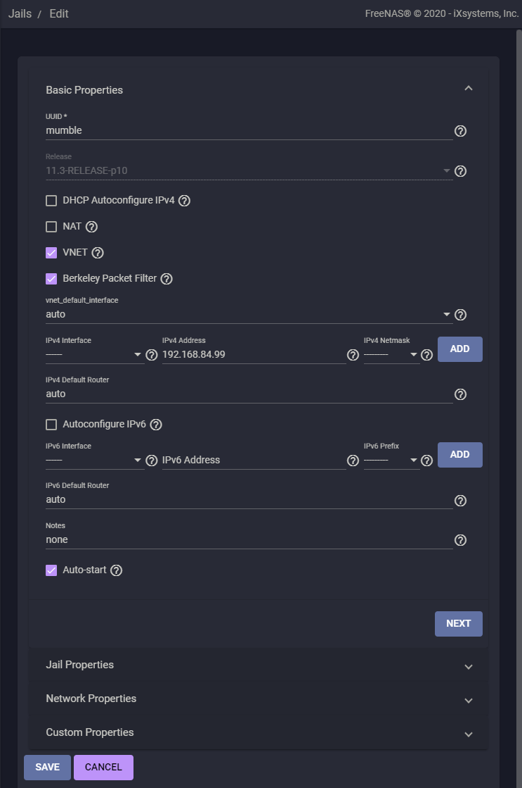

[ [<< Back to Main Menu](https://github.com/seth586/guides/blob/master/README.md) ]

[ [Intro](README.md) ] - [ **Jail Creation** ] - [ [murmur](2_murmur.md) ] - [ [SSL & Domain](3_ssl_domain.md) ] - [ [Basic ACL Config](4_acl.md) ]

## Guide to Mumble server (murmur) on FreeNAS/TrueNAS
### Jail Creation

Jails are a way to seperate computing environments. Since we are exposing murmur to the internet, we wouldn't want our whole system compromised if our murmur server got compromised. It also helps us partition software on our system. Make a mistake? No worries, just nuke the jail and start over!

Login to the TrueNAS web-ui. Create a new jail with a static IP address outside the range of your router's DHCP IP range. The default DHCP range on openwrt is 192.168.0.100 thru 192.168.0.254, I will use 192.168.84.99 as an example and call the jail 'blog'.



## Port forward rules for your router

Log in to your OpenWRT web-ui and configure UDP and TCP forwarding for port 64738:

Click "Network ▼", "Firewall". Click the "Port Forwards" tab, then click "Add".


Click "Save". Notice the  icon. The configuration will not work until you click . You should now see the following configuration:


## SSH into your new jail
SSH into TrueNAS and switch to your blog jail.
```
# iocage console mumble
```

Next: [ [murmur](2_murmur.md) ] >>
